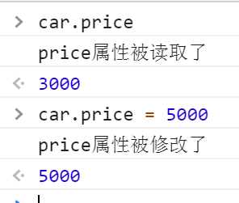

#### vue2双向绑定原理

>vue.js 则是采用**数据劫持结合发布者-订阅者模式**的方式，通过`Object.defineProperty()`来劫持各个属性的setter，getter，在数据变动时发布消息给订阅者，触发相应的监听回调。


要实现mvvm的双向绑定，就必须要实现以下几点：

- 1、实现一个数据监听器Observer，能够对数据对象的所有属性进行监听，如有变动可拿到最新值并通知订阅者
- 2、实现一个指令解析器Compile，对每个元素节点的指令进行扫描和解析，根据指令模板替换数据，以及绑定相应的更新函数
- 3、实现一个Watcher，作为连接Observer和Compile的桥梁，能够订阅并收到每个属性变动的通知，执行指令绑定的相应回调函数，从而更新视图
- 4、mvvm入口函数，整合以上三者


> 在`Vue`中，不论是`Object`型数据还是`Array`型数据所实现的数据变化侦测都是深度侦测，所谓深度侦测就是不但要侦测数据自身的变化，还要侦测数据中所有子数据的变化。

#### 一、Object的变化检测

1.1 检测采用``Object.defineProperty()``

首先，我们定义一个数据对象`car`：

```javascript
let car = {
  'brand':'BMW',
  'price':3000
}
```

接下来，我们使用`Object.defineProperty()`改写上面的例子

```javascript
let car = {}
let val = 3000
Object.defineProperty(car, 'price', {
  enumerable: true,
  configurable: true,
  get(){
    console.log('price属性被读取了')
    return val
  },
  set(newVal){
    console.log('price属性被修改了')
    val = newVal
  }
})
```

 


vue中定义了`observer`类，它用来将一个正常的`object`转换成可观测的`object`。

并且给`value`新增一个`__ob__`属性，值为该`value`的`Observer`实例。这个操作相当于为`value`打上标记，表示它已经被转化成响应式了，避免重复操作


1.2 依赖管理器`Dep`类

现在能知道数据什么时候发生了变化，当数据发生变化时，我们去通知视图更新。

我们把"谁用到了这个数据"称为"谁依赖了这个数据",我们给每个数据都建一个依赖数组(因为一个数据可能被多处使用)，谁依赖了这个数据(即谁用到了这个数据)我们就把谁放入这个依赖数组中，那么当这个数据发生变化的时候，我们就去它对应的依赖数组中，把每个依赖都通知一遍，告诉他们："你们依赖的数据变啦，你们该更新啦！"。这个过程就是依赖收集。

**在getter中收集依赖，在setter中通知依赖更新**

把收集到的依赖用`Dep`类管理


1.3 那么依赖到底是谁？依赖就是`Watcher`类

谁用到了数据，谁就是依赖，我们就为谁创建一个`Watcher`实例。在之后数据变化时，我们不直接去通知依赖更新，而是通知依赖对应的`Watcher`实例，由`Watcher`实例去通知真正的视图。


> 不足：
>
> 虽然我们通过`Object.defineProperty`方法实现了对`object`数据的可观测，但是这个方法仅仅只能观测到`object`数据的取值及设置值，当我们向`object`数据里添加一对新的`key/value`或删除一对已有的`key/value`时，它是无法观测到的，导致当我们对`object`数据添加或删除值时，无法通知依赖，无法驱动视图进行响应式更新。
>
> 当然，`Vue`也注意到了这一点，为了解决这一问题，`Vue`增加了两个全局API:`Vue.set`和`Vue.delete`


#### 二、Array的变化检测

还是在获取数据时收集依赖，数据变化时通知依赖更新

2.1 收集依赖

```javascript
data(){
  return {
    arr:[1,2,3]
  }
}
```

`arr`这个数据始终都存在于一个`object`数据对象中，所以还是从getter中收集依赖


2.2 通知依赖更新

```javascript
let arr = [1,2,3]
arr.push(4)
Array.prototype.newPush = function(val){
  console.log('arr被修改了')
  this.push(val)
}
arr.newPush(4)
```

由于`Array`型数据没有`setter`，`Vue`中创建了一个数组方法拦截器，它拦截在数组实例与`Array.prototype`之间，在拦截器内重写了操作数组的一些方法，当数组实例使用操作数组方法时，其实使用的是拦截器中重写的方法，而不再使用`Array.prototype`上的原生方法.

`push`,`pop`,`shift`,`unshift`,`splice`,`sort`,`reverse`


> 不足：
>
> 日常开发还可能通过如下改变数据
>
> ```javascript
> let arr = [1,2,3]
> arr[0] = 5;       // 通过数组下标修改数组中的数据
> arr.length = 0    // 通过修改数组长度清空数组
> ```
>
> 而使用上述例子中的操作方式来修改数组是无法侦测到的。 同样，`Vue`也注意到了这个问题， 为了解决这一问题，`Vue`增加了两个全局API:`Vue.set`和`Vue.delete`